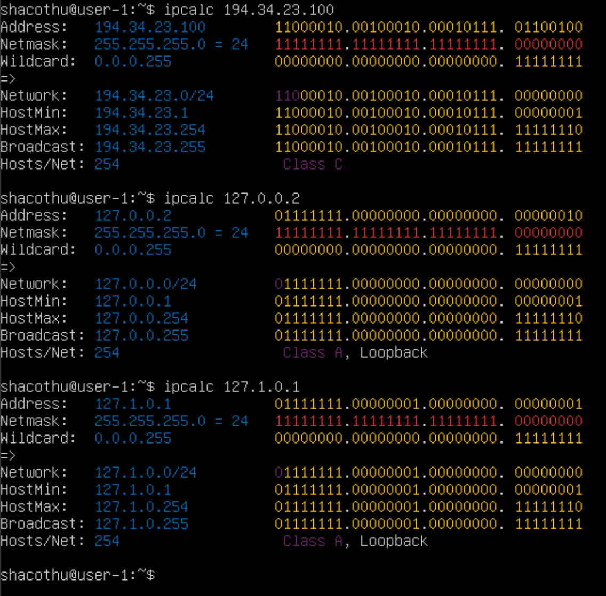
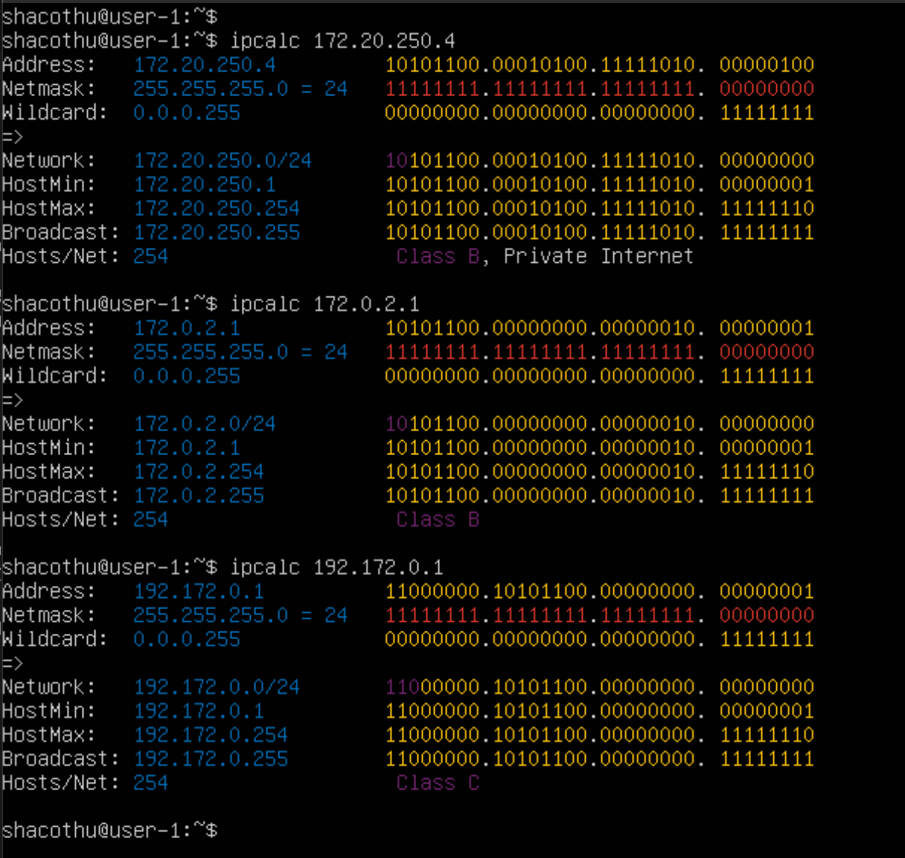
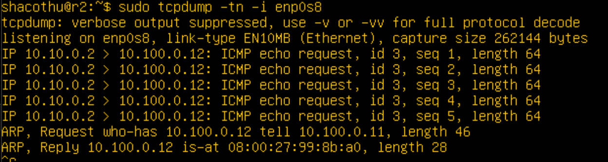

## Part 1. Инструмент ipcalc
### 1.1. Сети и маски:
#### 1) Адрес сети 192.167.38.54/13 
* Для вывода адреса сети воспользуемся утилитой ipcalc, которую предварительно скачаем командой
```sudo apt install ipcalc```
Далее введём команду
```ipcalc -b 192.167.38.54/13```


Флаг `-b` позволяет скрыть двоичный вывод. 

### 2) Перевод маски 255.255.255.0 в префиксную и двоичную запись, /15 в обычную и двоичную, 11111111.11111111.11111111.11110000 в обычную и префиксную  
Обычная запись - 255.255.255.0.

Префиксная запись - `/24`. 

Двоичная запись - `11111111.11111111.11111111.00000000`  

---
Префиксная запись - `/15`. 

Обычная запись - `255.254.0.0`. 

Двоичная запись - `11111111.11111110.00000000.00000000`  

---

  
Двоичная запись - 11111111.11111111.11111111.11110000 

Обычная запись - `255.255.255.240`. 

Префиксная запись - `/28`.  

---

#### 3) Минимальный и максимальный хост в сети 12.167.38.4 при масках: /8, 11111111.11111111.00000000.00000000, /4  

  

  

### 1.2. Localhost  
#### Определить и записать в отчёт, можно ли обратиться к приложению, работающему на localhost, со следующими IP: 194.34.23.100, 127.0.0.2, 127.1.0.1, 128.0.0.1  
* Для localhost зарезервирован диапазон ip адресов от 127.0.0.1 до 127.255.255.254 включительно. Из этого можем сделать вывод, что мы сможем обратиться к приложениям, работающим со следующими ip: `127.0.0.2`, `127.1.0.1`.  
Проверим:  

   

  

### 1.3. Диапазоны и сегменты сетей  
#### 1) Какие из перечисленных IP можно использовать в качестве публичного, а какие только в качестве частных: 10.0.0.45, 134.43.0.2, 192.168.4.2, 172.20.250.4, 172.0.2.1, 192.172.0.1, 172.68.0.2, 172.16.255.255, 10.10.10.10, 192.169.168.1  
* Выведем информацию обо всех ip адресах с помощью команды `ipcalc <ip адрес>`  

  
  
  
 
 
Нас интересует строка "Hosts/Net" и конкретно надпись "Private Internet", наличие которой говорит о том, что ip адрес принадлежит частной сети.  
Вывод:  
* Адреса `10.0.0.45`, `192.168.4.2`, `172.20.250.4`, `172.16.255.255`, `10.10.10.10` можно использовать только в качестве частных.  
* Адреса `134.43.0.2`, `172.0.2.1`, `192.172.0.1`, `172.68.0.2`, `192.169.168.1` можно использовать в качестве публичных.  

#### 2) Какие из перечисленных IP адресов шлюза возможны у сети 10.10.0.0/18: 10.0.0.1, 10.10.0.2, 10.10.10.10, 10.10.100.1, 10.10.1.255  
* Воспользуемся командой `ipcalc 10.10.0.0/18` 
 

  
Возможны адреса `10.10.0.2`, `10.10.10.10` и `10.10.1.255` 

## Part 2. Статическая маршрутизация между двумя машинами  

#### Поднять две виртуальные машины (далее -- ws1 и ws2)
#### С помощью команды ip a посмотреть существующие сетевые интерфейсы  
* ws1
  

* ws2
  
  

#### Описать сетевой интерфейс, соответствующий внутренней сети, на обеих машинах и задать следующие адреса и маски: ws1 - 192.168.100.10, маска /16, ws2 - 172.24.116.8, маска /12  
* На обеих машинах выполняем команду `sudo vim /etc/netplan/00-installer-config.yaml` и вносим изменения.  
* ws1  

  
* ws2 
 
  

#### Выполнить команду netplan apply для перезапуска сервиса сети  
* ws1
  
  
* ws2
  
  

### 2.1. Добавление статического маршрута вручную  
#### Добавить статический маршрут от одной машины до другой и обратно при помощи команды вида ip r add  
#### Пропинговать соединение между машинами  
* Команда для ws1: `sudo ip r add 172.24.116.8 dev enp0s3` (скрин неудачный. Я до этого вводил эту команду)
  
  
* Команда для ws2: `sudo ip r add 192.168.100.10 dev enp0s3`
  
  

### 2.2. Добавление статического маршрута с сохранением  
#### Перезапустить машины  
* Используем команду `sudo reboot`  

#### Добавить статический маршрут от одной машины до другой с помощью файла etc/netplan/00-installer-config.yaml  
* ws1
  
  
* ws2
  
  

#### Пропинговать соединение между машинами  
* ws1
  
  
* ws2
  
  

## Part 3. Утилита iperf3  
### 3.1. Скорость соединения  
#### Перевести и записать в отчёт: 8 Mbps в MB/s, 100 MB/s в Kbps, 1 Gbps в Mbps  
* 8 Mbps = 1 MB/s  
* 100 MB/s = 819200 Kbps  
* 1 Gbps = 1024 Mbps  

### 3.2. Утилита iperf3  
#### Измерить скорость соединения между ws1 и ws2  
* ws1 выступает в роли сервера. Запуск iperf3 сервер, команда: `iperf3 -s`   
* ws2 выступает в роли клиента. Запуск iperf3 клиент, команда: `iperf3 -c 192.168.100.10`
  
  
- скорость ws1(sender) = 2.04 Gb/s

  
- скорость ws2(receiver) = 2.02 Gb/s

## Part 4. Сетевой экран  
### 4.1. Утилита iptables  
#### Создать файл /etc/firewall.sh, имитирующий фаерволл, на ws1 и ws2:
    #!/bin/sh  

    # Deleting all the rules in the "filter" table (default).  
    iptables -F  
    iptables –X  

#### Нужно добавить в файл подряд следующие правила:  

#### 1) на ws1 применить стратегию когда в начале пишется запрещающее правило, а в конце пишется разрешающее правило (это касается пунктов 4 и 5)  

#### 2) на ws2 применить стратегию когда в начале пишется разрешающее правило, а в конце пишется запрещающее правило (это касается пунктов 4 и 5)  

#### 3) открыть на машинах доступ для порта 22 (ssh) и порта 80 (http)  

#### 4) запретить echo reply (машина не должна "пинговаться”, т.е. должна быть блокировка на OUTPUT)  

#### 5) разрешить echo reply (машина должна "пинговаться")  

* добавляем правила для ws1:
  
  
Запрещаем echo-reply, открываем доступ для портов 22 и 80, разрешаем echo-reply.  


* добавляем правила для ws2:
  
  
Разрешаем echo-reply, открываем доступ для портов 22 и 80, запрещаем echo-reply.  

#### Запустить файлы на обеих машинах командами `chmod +x /etc/firewall.sh` и `/etc/firewall.sh` 

 
 

* Разница между стратегиями заключается в том, что в первом файле первым подходящим правилом для пакета является запрет, а во втором - разрешение. Применяется только первое подходящее правило, остальные игнорируются.  

### 4.2. Утилита nmap  
#### Командой ping найти машину, которая не "пингуется", после чего утилитой nmap показать, что хост машины запущен  
_Проверка: в выводе nmap должно быть сказано: `Host is up`_  
* пингуем ws2 с ws1  

* пингуем ws1 с ws2 и видим, что машина не "пингуется". Сразу проверяем утилитой nmap.  
* Видим сообщение `Host is up`  

 
 

## Part 5. Статическая маршрутизация сети

- Поднимем пять виртуальных машин (3 рабочие станции (ws11, ws21, ws22) и 2 роутера (r1, r2))

#### 5.1. Настройка адресов машин

- Изменим конфигурацию рабочих станций _ws11_, _ws21_, _ws22_


- Изменим конфигурацию роутеров _r1_, _r2_


- Перезапустим сервис сети с помощбю `sudo netplan apply`. Командой `ip -4 a` проверим, что адрес машины задан верно


- Пропингуем ws22 с ws21
- Пропингуем r1 с ws11


#### 5.2. Включение переадресации IP-адресов

- Для включения переадресации IP, выполним команду на роутерах: `sysctl -w net.ipv4.ip_forward=1`


> Переадресация не будет работать после перезагрузки системы

- Для включения переадресации на постоянной основе, в файле */etc/sysctl.conf* раскомментируем следующую строку: `net.ipv4.ip_forward = 1`


- Проверим командой `sysctl net.ipv4.ip_forward`

> IP-переадресация включена на постоянной основе

#### 5.3. Установка маршрута по-умолчанию

- Настроим маршрут по-умолчанию (шлюз) для рабочих станций. Для этого добавим `default` перед IP роутера в файле конфигураций *etc/netplan/00-installer-config.yaml*


- Примем изменения с помощью` sudo netplan apply`
- Просмотрим с помощью `ip r`, что маршрут был добавлен в таблицу маршрутизации. Первая строчка с _default_ соответсвует добавленным маршрутам


- Пропингуем с ws11 роутер r2

- Покажем на r2, что пинг доходит. Для этого прослушиваем интерфейс _enp0s8_




> Таким образом, пинг с ws11 доходит до r2, но поскольку роутеру неизвестно, куда возвращать пакеты, они не возвращаются назад, о чем сообщает результаты команды "0 received, 100% lost"

#### 5.4. Добавление статических маршрутов

- Добавим в роутеры r1 и r2 статические маршруты в файле конфигураций


- Примем изменения конфигурации: `sudo netplan apply`
- Покажем таблицы с маршрутами с помощью `ip r`


- Запустим команды на ws11: `ip r list 10.10.0.0/[маска сети]` и `ip r list 0.0.0.0/0`


> Для адреса _10.10.0.0/18_ не был выбран такой же маршрут как для _0.0.0.0/0_, потому что пакеты  отправляется на него только тогда, когда другой маршрут не задан явным образом в таблице маршрутизации хоста. Так как _ws11_ находится внутри сети 10.10.0.0/18, то для связи с ней она использует свой IP-адрес _10.10.0.2_. Адрес _0.0.0.0/0_ находится в другой сети, поэтому ws1 отправляет данные на роутер, используя маршрут по умолчанию, прописанный в файле конфигурации (10.10.0.1)


#### 5.5. Построение списка маршрутизаторов

- Запустим на r1 команду дампа: `tcpdump -tnv -i enp0s8`


- При помощи утилиты traceroute построим список маршрутизаторов на пути от _ws11_ до _ws21_


> Из дампа на r1 видно, что пакет проходит через маршрутизаторы для достижения указанного адреса. На этом основан принцип работы traceroute. <br><br>
Каждый пакет проходит на своем пути определенное количество узлов, пока достигнет своей цели. Причем, каждый пакет имеет свое время жизни. Это количество узлов, которые может пройти пакет перед тем, как он будет уничтожен. Этот параметр записывается в заголовке TTL, каждый маршрутизатор, через который будет проходить пакет уменьшает его на единицу. При TTL=0 пакет уничтожается, а отправителю отсылается сообщение Time Exceeded. <br><br>
Команда traceroute linux использует UDP пакеты. Она отправляет пакет с TTL=1 и смотрит адрес ответившего узла, дальше TTL=2, TTL=3 и так пока не достигнет цели. Каждый раз отправляется по три пакета и для каждого из них измеряется время прохождения. Пакет отправляется на случайный порт, который, скорее всего, не занят. Когда утилита traceroute получает сообщение от целевого узла о том, что порт недоступен трассировка считается завершенной.

#### 5.6. Использование протокола **ICMP** при маршрутизации

> **_ICMP_** (англ. Internet Control Message Protocol — протокол межсетевых управляющих сообщений[1]) — сетевой протокол, входящий в стек протоколов TCP/IP. В основном ICMP используется для передачи сообщений об ошибках и других исключительных ситуациях, возникших при передаче данных

- Запустим на r1 команду: `tcpdump -n -i enp0s8 icmp`

- Пропингуем с ws11 несуществующий IP с помощью команды: `ping -c 1 10.30.0.111`

- Отследим перехват сетевого трафика, проходящего через _enp0s8_ на r1


> Таким образом, пакеты, отправителенные на 10.30.0.111, проходят через путь по-умолчанию через роутер r1

## Part 6. Динамическая настройка IP с помощью **DHCP**

- Для работы с протоколом DHCP сначала надо установим утилиту на r2: `sudo apt-get install isc-dhcp-server`

- Для r2 настроим в файле /etc/dhcp/dhcpd.conf конфигурацию службы DHCP


- В файле *resolv.conf* пропишем `nameserver 8.8.8.8.`


- Перезагрузим службу **DHCP** командой `systemctl restart isc-dhcp-server`


- Машину ws21 перезагрузим при помощи `reboot`

- Через `ip a` показажем, что ws21 получила адрес. 

- Пропингуем ws22 с ws21


##### Указать MAC адрес у ws11, r1 настроить аналогично r2 с выдачей адресов с жесткой привязкой к MAC-адресу 

- Указать MAC адрес у ws11, для этого в *etc/netplan/00-installer-config.yaml* надо добавить строки: `macaddress: 10:10:10:10:10:BA`, `dhcp4: true`


- Принимаем изменения: `sudo netplan apply`

- Также выключаем вм и в настройках сети указываем MAC-адрес


- Для работы с протоколом DHCP сначала надо установим утилиту на r1: `sudo apt-get install isc-dhcp-server`

- Для r1 настроим в файле /etc/dhcp/dhcpd.conf конфигурацию службы DHCP


- В файле *resolv.conf* пропишем `nameserver 8.8.8.8`


- Перезагрузим службу **DHCP** командой `systemctl restart isc-dhcp-server`


- Машину ws11 перезагрузим при помощи `reboot`

- Через `ip a` показажем, что ws11 получила mac-адрес


- Пропингуем ws11 с ws21


##### Запросить с ws21 обновление ip адреса

- Выполним `ip a` до обновления адреса


- Запросим с ws21 обновление ip адреса. Для этого выполняем
    - `sudo dhclient -r enp0s8` (-r означает освободить IP-адрес)
    - `sudo dhclient`
    - `ip a`


 


